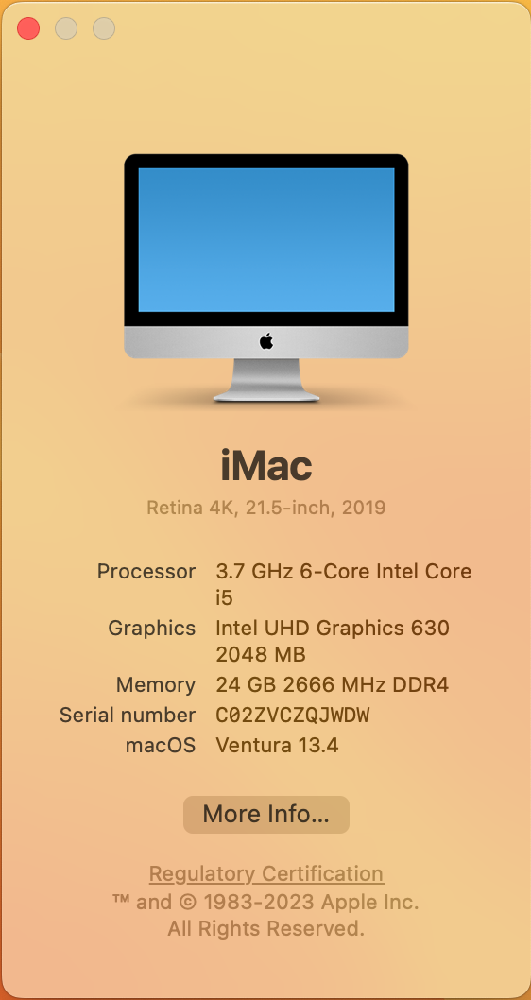

Gigabyte-Z390I-OC Hackinton

Every things just work fine.

| CPU                   | 8700K                                                      |
| --------------------- | ---------------------------------------------------------- |
| GPU                   | Intel UHD Graphics 630                                     |
| Motherboard           | Gigabyte Z390I AORUS PRO WIFI                              |
| SSD                   | Samsung SSD 970 EVO 500GB                                  |
| Ethernet              | Motherboard with Intel I219V7 PCI Express Gigabit Ethernet |
| Wireless Network Card | Broadcom BCM943602CS                                       |
| OpenCore              | 0.9.2                                                      |
| macOS                 | Ventura 13.4                                               |

